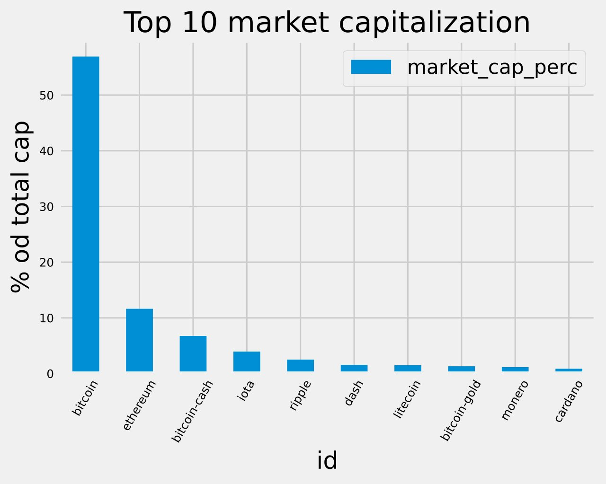
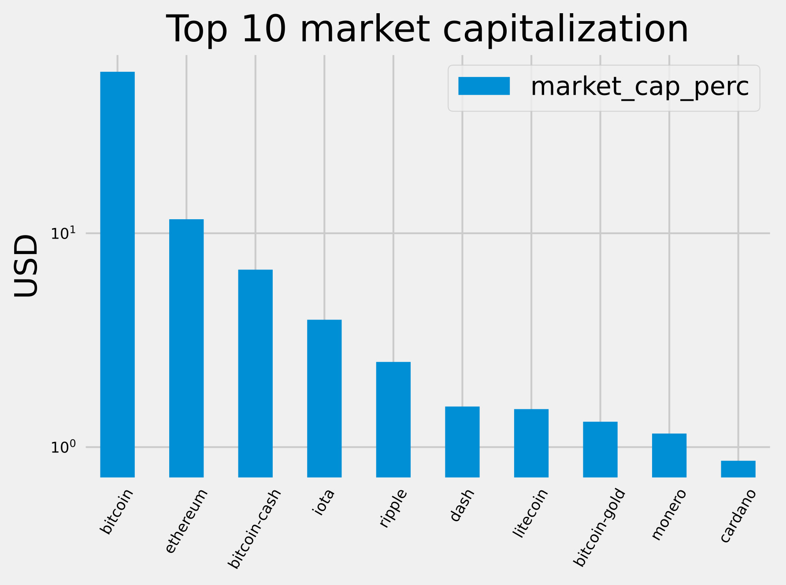
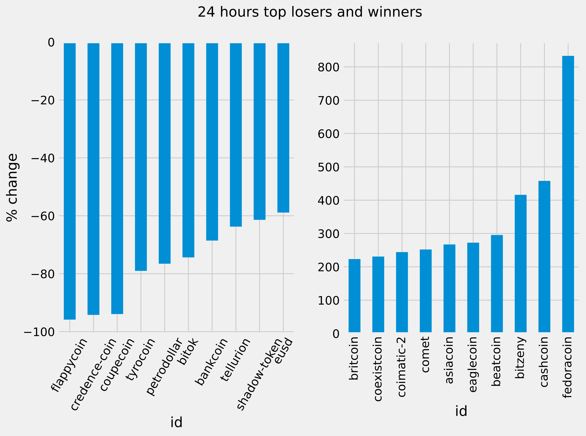
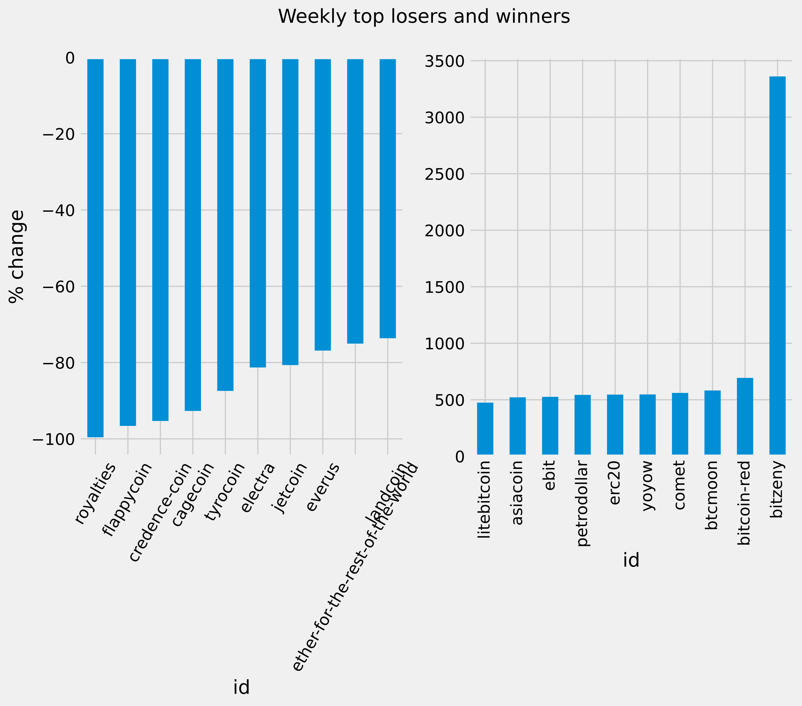
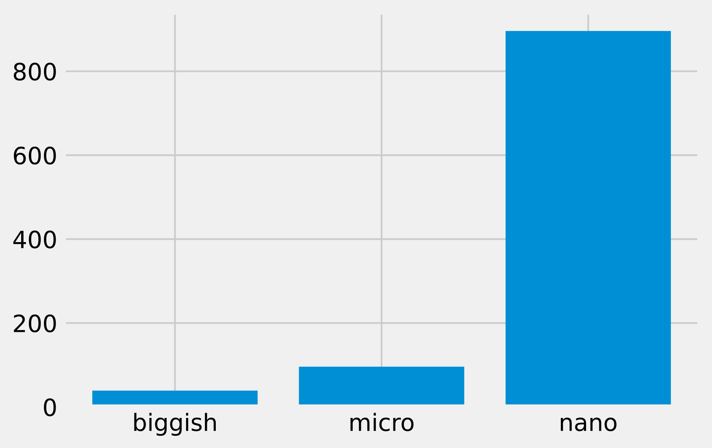

# Exploring-the-Bitcoin-Cryptocurrency-Market 📈
## This is my first data science project and was a very uselful starting point
## This was a guided project from DATACAMP 👨‍💻⚙
_NOTE : Data is old_  
**Technologies used** 
<ul>
  <li> Python
  <li> Pandas module
  <li> matplotlib
  <li> Jupyter-lab for coding 
 </ul>
 
 ## PLOTS

  
  
  
  
  

## INSIGHTS
<ul>
  <li> Most of the coins are very small when taking about valuation </li>
  <li> Volatility is massive in crypto market and smaller coins are more volatile </li>
  <li> Bitcoin is undisputed market leader </li>
</ul>

#### I realize that some of this insights are not that useful in 2021 but they help us picture what was crypto market in 2017 in general
